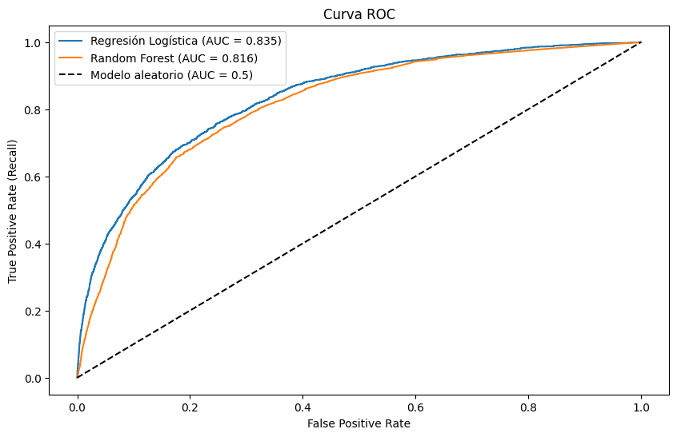
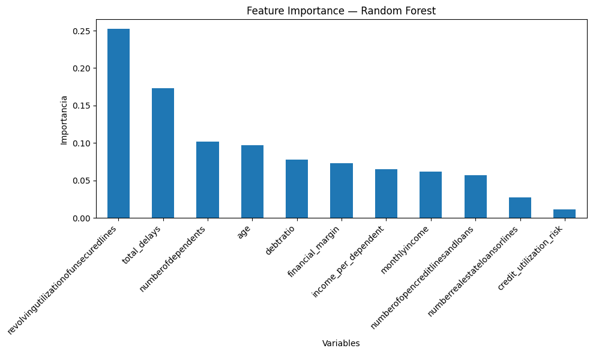

# Credit Risk Analysis
## Predicción de Riesgo Crediticio — Give Me Some Credit

### Descripción
- Este proyecto analiza el riesgo crediticio de clientes bancarios utilizando el dataset "Give Me Some Credit" de Kaggle.
- El objetivo es predecir si un cliente tendrá problemas de pago en los próximos 2 años, combinando Machine Learning, análisis SQL y visualización en Power BI.

---

### Hipótesis de negocio
- ¿Qué perfil de cliente tiene mayor riesgo de impago y qué factores son más determinantes para predecirlo?

---

### 🛠️ Tecnologías utilizadas
- **Python** — análisis de datos y modelado ML
- **Pandas / NumPy** — limpieza y manipulación de datos
- **Scikit-learn** — modelos de Machine Learning
- **MySQL** — almacenamiento y consultas SQL
- **Power BI** — dashboard interactivo
- **GitHub** — control de versiones
---

### Estructura del repositorio
FinalProject_-Credit_Risk_Analysis/
│
├── data/
│   ├── raw/                    # Dataset original de Kaggle
│   └── processed/              # Datasets limpios y procesados
│
├── notebooks/
│   ├── 01_data_loading_and_inspection.ipynb
│   ├── 02_data_cleaning.ipynb
│   ├── 03_EDA.ipynb
│   ├── 04_feature_engineering.ipynb
│   ├── 05_modeling.ipynb
│   ├── 06_feature_importance.ipynb
│   └── 07_sql_analysis.ipynb
│
├── reports/                    # Gráficos y reportes
├── src/                        # Funciones reutilizables
├── credit_risk_dashboard.pbix  # Dashboard Power BI
├── requirements.txt            # Dependencias del proyecto
└── README.md
---

### 🚀 Cómo ejecutar el proyecto

1. **Clonar el repositorio**
- git clone https://github.com/erikajcd08/FinalProject_-Credit_Risk_Analysis.git

2. **Crear el entorno virtual**
- conda create -n credit-risk python=3.13
- conda activate credit-risk

3. **Instalar dependencias**
- pip install -r requirements.txt

4. **Descargar el dataset**
- Ve a https://www.kaggle.com/datasets/brycecf/give-me-some-credit-dataset
- Descarga y descomprime el ZIP
- Coloca `cs-training.csv` en `data/raw/`

5. **Ejecutar los notebooks en orden**
- 01 → 02 → 03 → 04 → 05 → 06 → 07

6. **Para el SQL**
- Crea un archivo `.env` con tu contraseña de MySQL:

7. **Dashboard**
- Abre `credit_risk_dashboard.pbix` con Power BI Desktop
---

### Resultados principales

**Variables más importantes para predecir el impago:**
- `revolvingutilizationofunsecuredlines` — % de crédito utilizado (más importante)
- `total_delays` — historial total de retrasos en pagos
- `age` — los clientes más jóvenes tienen mayor riesgo

**Modelos entrenados y evaluados:**

| Modelo               |Accuracy | Precision | Recall | F1 |
| Regresión Logística  | 0.79 | 0.20 | 0.70 | 0.31 |
| Árbol de Decisión    |0.83 | 0.17 | 0.43 | 0.25 |
| Random Forest        | 0.89 | 0.28 | 0.46 | 0.35 |

**Modelos seleccionados:**
- **Random Forest** — para uso general del banco (mejor equilibrio)
- **Regresión Logística** — para situaciones de alto riesgo (mejor Recall)

**Conclusión de negocio:**
El historial de retrasos y el nivel de utilización del crédito son los factores más determinantes para predecir si un cliente tendrá problemas de pago.
---
---

### Capturas del proyecto

**Dashboard Power BI:**
---

---

### Capturas del proyecto

**Dashboard Power BI:**

**Curva ROC:**

**Feature Importance:**

### Mejoras futuras

- Renombrar columnas con formato snake_case completo para mejorar legibilidad
  (e.g. `revolvingutilizationofunsecuredlines` → `revolving_utilization_of_unsecured_lines`)
- Probar modelos más avanzados como XGBoost o redes neuronales
- Implementar técnicas avanzadas de feature selection con PCA
- Desplegar el modelo en una aplicación web
- Explorar análisis de series temporales para detectar patrones de impago
- Integrar datos actualizados del Banco de España para adaptar el modelo al mercado crediticio español al día.
- Reentrenar los modelos con datos más recientes para mejorar la generalización

---

### Autora
**Erika Juliet Campo Diaz** — DAFT2026 · Ironhack Remote ES

---